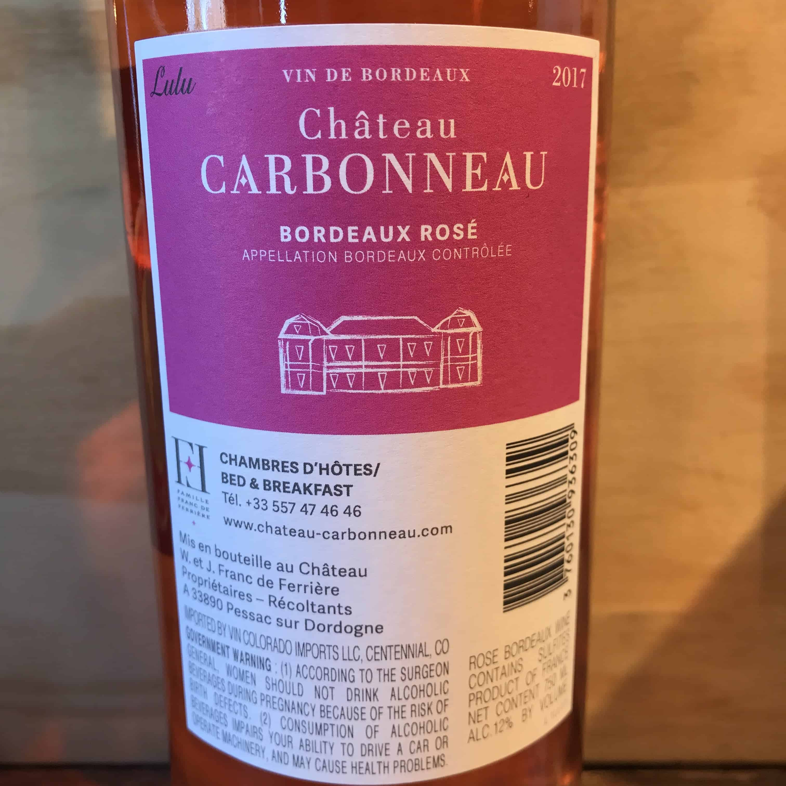
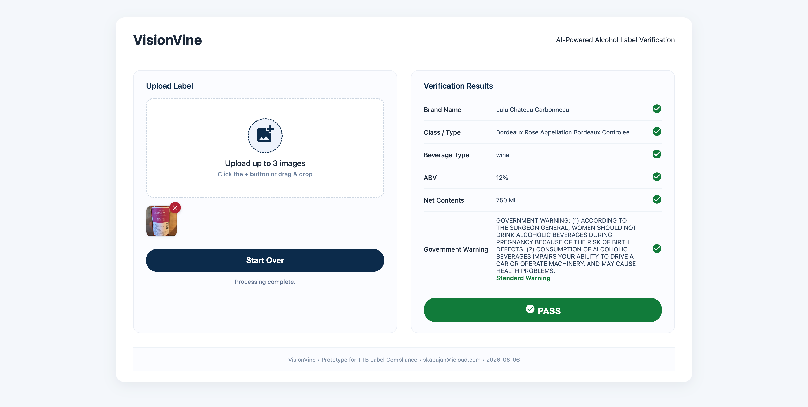
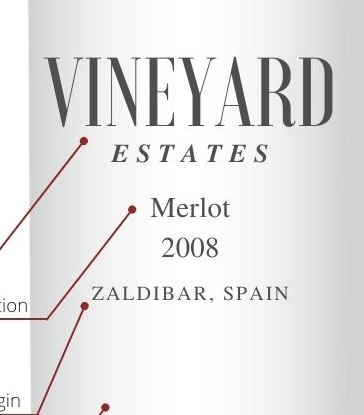
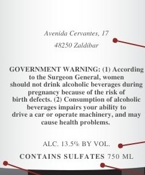
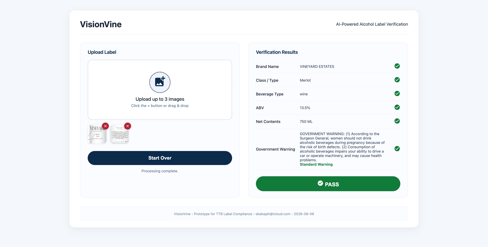
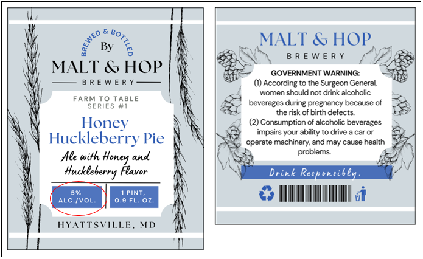
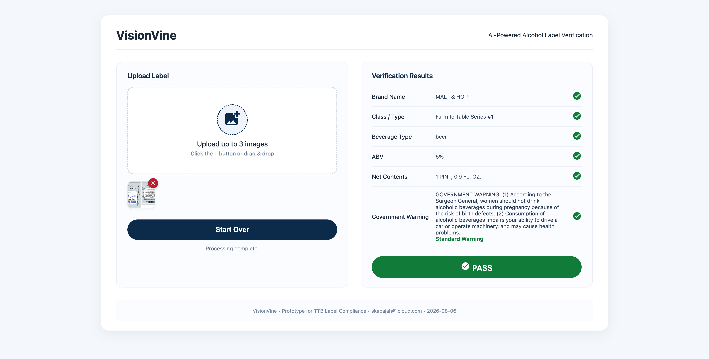

# VisionVine
### AI-Powered Alcohol Label Verification

---

## Author, Date & Live Demo

- **Author:** Shadi Kabajah
- **Email:** skabajah@icloud.com
- **Date:** August 2026
- **Live Demo:** [https://visionvine.onrender.com](https://visionvine.onrender.com)

---

## Overview

VisionVine is a web application that uses AI (Groq's Qwen 3.6-27b vision model) to extract and validate information from alcohol beverage labels. It is designed to assist TTB compliance agents in verifying that labels meet regulatory requirements — reducing manual review time from minutes to seconds.

---

## Features

- Upload **1–3 images per product** (front label, back label, angle shots)
- Supports:
  - **Single label image** (one picture)
  - **Multiple images** (2–3 pictures of the same product)
  - **Combined label** (multiple labels in one image)
- AI-powered text extraction (brand, class/type, ABV, net contents, government warning)
- Automatic beverage type detection (spirits, wine, beer)
- Validation of required fields
- Government Warning header check (must be in ALL CAPS)
- Pass/Fail results with field-by-field status
- Clean, modern UI with Material Icons
- Responsive design for desktop and mobile

---

## Demo Example

The `screenshots/` folder contains example results and test label images you can download and use to test the app.

| **File** | **Description** |
|----------|-----------------|
| `result-1.png` | PASS result — single label image |
| `result-2.png` | PASS result — two separate images (front + back) |
| `result-3.png` | PASS result — one image containing two labels (combined) |
| `sample_1.jpg` | Sample label image 1 (distilled spirits) |
| `sample_2a.jpg` | Sample label image 2a (front label) |
| `sample_2b.jpg` | Sample label image 2b (back label) |
| `sample_3.png` | Combined label image (front + back in one) |


### Gallery Preview


**Click any image to expand (opens in new tab).**
| **Input** | **Output** |
|-----------|------------|
| <a href="screenshots/sample_1.jpg" target="_blank"></a><br><sub>Single label image</sub> | <a href="screenshots/result-1.png" target="_blank"></a><br><sub>✅ PASS — single label</sub> |
| <a href="screenshots/sample_2a.jpg" target="_blank"></a> <a href="screenshots/sample_2b.jpg" target="_blank"></a><br><sub>Two separate images (front + back)</sub> | <a href="screenshots/result-2.png" target="_blank"></a><br><sub>✅ PASS — two images</sub> |
| <a href="screenshots/sample_3.png" target="_blank"></a><br><sub>One image containing two labels (combined)</sub> | <a href="screenshots/result-3.png" target="_blank"></a><br><sub>✅ PASS — combined label</sub> |

---

## Tech Stack

| **Component** | **Technology** | **Homepage** |
|---------------|----------------|--------------|
| Backend | Python + FastAPI | [fastapi.tiangolo.com](https://fastapi.tiangolo.com) |
| AI / OCR | Groq API (Qwen 3.6-27b) | [console.groq.com](https://console.groq.com/docs/model/qwen/qwen3.6-27b) |
| Icons | Google Material Icons | [fonts.google.com/icons](https://fonts.google.com/icons) |
| Frontend | HTML + CSS + JavaScript | — |
| Hosting | Render | [render.com](https://render.com) |
| Source Management | GitHub | [github.com](https://github.com) |
---

## UX Path

1. User lands on the page and sees a clean split-screen layout.
2. On the left panel, the user drags and drops **1–3 images** of an alcohol label (or clicks the + button to browse).
3. The user clicks **"Verify Label"**.
4. The app sends the image(s) to the backend, which calls Groq's vision model to extract:
   - Brand name
   - Class/Type
   - ABV
   - Net contents
   - Government warning
   - Beverage type
5. The extracted data is validated against TTB requirements.
6. Results appear on the right panel with:
   - Field-by-field PASS/FAIL status
   - Government Warning header check (must be in ALL CAPS)
   - Overall PASS or FAIL decision
7. The user can click **"Start Over"** to reset and test another label.

---

## Assumptions

- Supports 1–3 images per product
- Focus on distilled spirits labels (based on the sample provided in the assessment)
- Government Warning check only verifies the header is in ALL CAPS (not the full text)
- The app is a prototype and does not cover all legal variations
- Images should be clear enough for OCR (JPG, PNG, WebP supported)

---

## Limitations

- Batch upload for multiple products not yet implemented
- No matching against application form data
- Only one image is processed per request (the first uploaded)
- Wine and beer labels may have lower OCR accuracy due to decorative fonts

**Free Tier Notes:**
- The app runs on Render's free tier — if inactive for 15 minutes, it goes to sleep. It will wake up automatically on the next visit (may take 5–15 seconds).
- Groq API is used on the free tier — token limits apply (200,000 tokens per day). If exceeded, you may see a rate limit error. 
 

---

## File Structure

```
visionvine/
├── main.py
├── requirements.txt
├── screenshots/
│   ├── result-1.png
│   ├── result-2.png
│   ├── result-3.png
│   ├── sample_1.jpg
│   ├── sample_2a.jpg
│   ├── sample_2b.jpg
│   └── sample_3.png
├── static/
│   ├── index.html
│   ├── app.js
│   ├── cleaner.js
│   └── style.css
└── README.md
```

---

## Contact

**Shadi Kabajah**  
skabajah@icloud.com 
